# Multi-Robot Warehouse Simulation: Algorithm, Flow, Physics, and Collision Avoidance

## 1. System Overview

This project simulates a multi-robot warehouse in Isaac Sim.

Main runtime entry:

- `main_isaac/main.py`
- `main_isaac/robot_config.py`
- `main_isaac/world_setup.py`

Main robots:

- Drone: joystick/manual flight plus Y-button grab assist and X-button delivery assist.
- M0609 arms: ArUco vision detection, visual servoing, suction pick-and-place.
- IW Hub mobile bases: pod transport using scripted finite-state machines.
- Spot robots: patrol, ArUco/box detection, pick-and-place, collision-aware navigation.

Core architecture:

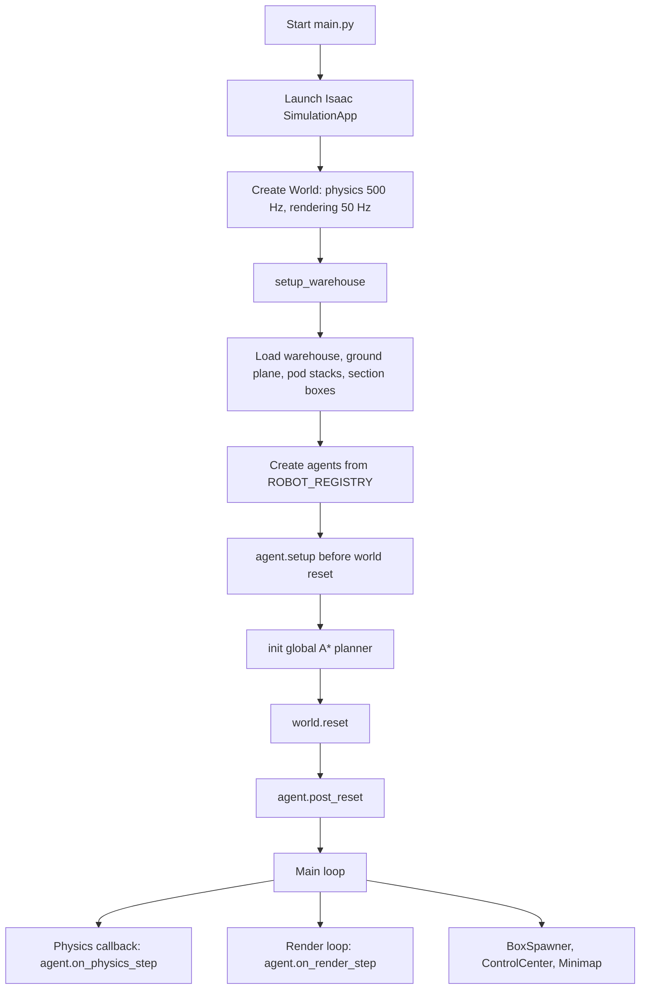

## 2. Warehouse and Object Setup

`world_setup.py` creates the shared physical environment:

- Adds a default ground plane at `z=0` so robots and boxes cannot fall through the floor.
- Loads the warehouse USD map.
- Spawns fixed pod stacks.
- Spawns section pods for sections A/B/C.
- Pre-places stacked ArUco boxes for drone pickup.
- Spawns dynamic ArUco boxes periodically on the conveyor.

Box physics:

- Section boxes are created as rigid bodies with mass `2.0 kg`.
- Pre-stacked section boxes start as kinematic so they remain stable until a robot grabs them.
- Dynamic conveyor boxes are assigned `2.0 kg`.
- When a robot grabs a box, the box becomes kinematic and is transformed with the robot.
- When released, the box becomes dynamic again so gravity and collision determine the final placement.

## 3. Global Control Loop

Isaac Sim uses two main update rates:

- Physics loop: `500 Hz`, used for robot control, odometry, PID, FSM updates, and physics response.
- Rendering loop: `50 Hz`, used for cameras, HUD, minimap, and UI updates.

Runtime loop:

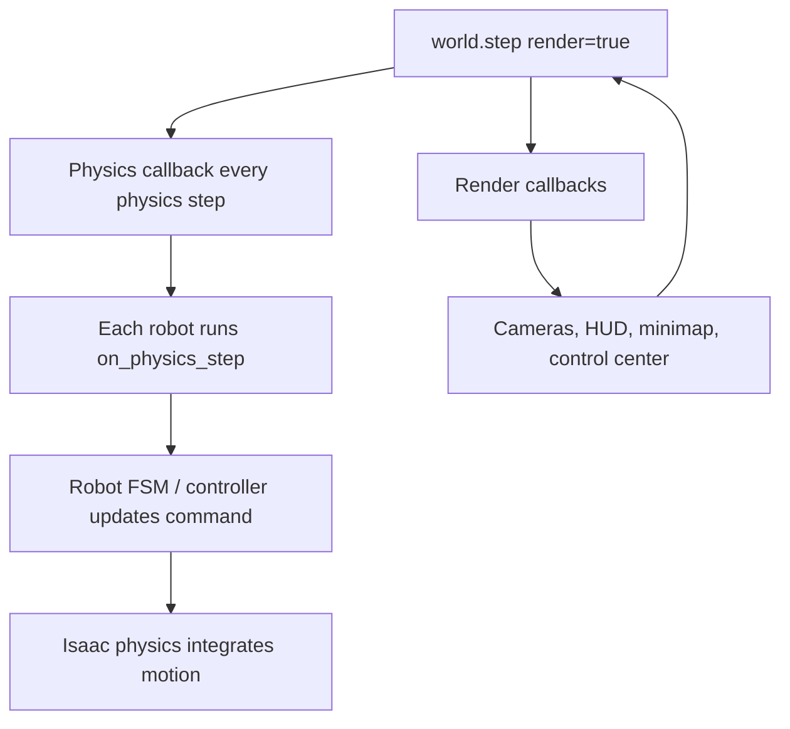

## 4. Drone Algorithm

Relevant files:

- `main_isaac/robots/drone/drone_agent.py`
- `main_isaac/robots/drone/drone_deps/controller.py`

### 4.1 Manual Joystick Control

The joystick updates the drone target continuously while the stick is held.

Algorithm:

1. Read joystick axes in a background thread.
2. Normalize raw values and apply dead zone.
3. If the drone is airborne and no autopilot is active:
   - Convert stick input into desired world velocity.
   - Set `target_pos = current_position + velocity * lookahead_time`.
   - Update yaw target from right stick.
4. Geometric controller computes thrust and torque from target error.

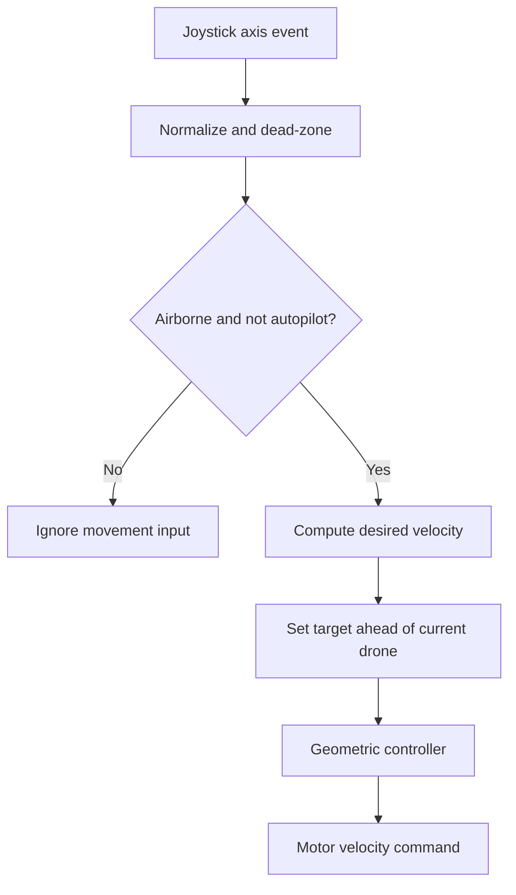

### 4.2 Drone Physics Controller

The controller is a geometric nonlinear position-attitude controller.

Main physics principle:

- Position error: `ep = current_position - target_position`
- Desired force:

```text
F_des = -Kp*ep - Kd*v - Ki*integral + m*g
```

- The thrust direction is aligned with `F_des`.
- The desired attitude is built from desired yaw and desired thrust axis.
- Rotation error produces torque:

```text
tau = -Kr*rotation_error - Kw*angular_velocity
```

- Total thrust and torque are converted to individual rotor velocities by the Pegasus multirotor model.

Presentation point:

The drone is not teleported during flight. It follows a target position using force, gravity compensation, damping, and attitude control.

### 4.3 Y Button: Assisted Grab

Purpose:

- If the drone is near a box, pressing Y temporarily enables autopilot.
- The drone moves to the exact box center, descends until the suction cup reaches the top of the box, grabs it, then ascends to `2.5 m`.

Flow:

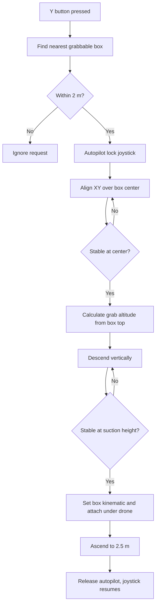

Important details:

- Lower stacked boxes ending `_b1` and `_b2` are skipped so the drone selects the top accessible box.
- Box top height is computed from the USD world bounding box.
- The drone suction cup bottom offset is measured from the scene.
- The grab altitude is computed so the suction cup contacts the box top.

### 4.4 X Button: Assisted Delivery

Purpose:

- If carrying a box, pressing X enables autopilot.
- The drone flies to delivery world coordinate `(12, 12)`, waits until stable, releases the box without descending, ascends/holds at `2.5 m`, then returns to spawn at `z=2.5`.

Flow:

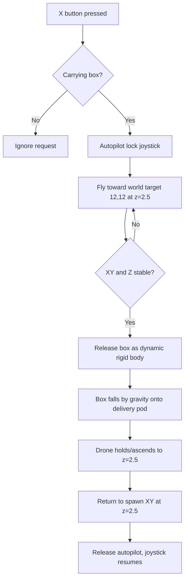

Delivery physics:

- While carried: the box is kinematic and follows the drone transform.
- At release: kinematic is disabled, so gravity acts on the box.
- The box falls onto the delivery pod using Isaac Sim collision and rigid-body dynamics.

### 4.5 Drone Safety and Collision Avoidance

Implemented safety:

- Drone body collisions remain enabled, so landing can contact the ground plane.
- Sucker collision is disabled because it is a visual tool and should not hit walls/floor.
- Autopilot uses:
  - XY clamping inside a safe map boundary.
  - Altitude ceiling recovery if the drone rises above `2.75 m`.
  - Wall guard recovery if the drone leaves safe air space.
  - Lookahead target movement to avoid huge target jumps and controller overshoot.

Safety logic:

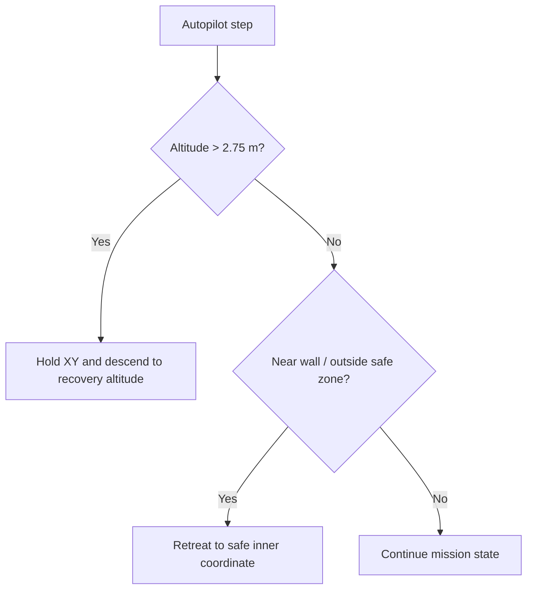

## 5. M0609 Robot Arm Algorithm

Relevant file:

- `main_isaac/robots/m0609/m0609_agent.py`

Role:

- Detect ArUco-marked boxes.
- Estimate or read box world position.
- Move above the box.
- Servo down to the top surface.
- Attach by making the box kinematic.
- Move to goal.
- Release by making the box dynamic.
- Signal IW Hub after completed work.

FSM:

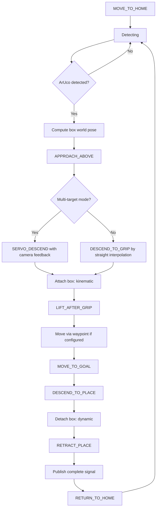

Computer vision principle:

- Camera image is converted to OpenCV BGR.
- ArUco detector identifies marker corners and ID.
- For normal mode, pose can be estimated from marker geometry.
- For multi-target mode, the code often uses the USD stage directly to find the box with the matching ArUco texture, which avoids pose-estimation scale errors.

Manipulation physics:

- The arm itself is controlled by RMPFlow inverse kinematics.
- The suction gripper is a visual/logic tool, not a simulated vacuum pressure field.
- Pick is modeled by switching the box to kinematic and maintaining a fixed transform relative to the end-effector.
- Release is modeled by switching back to dynamic rigid-body physics.

## 6. IW Hub Algorithm

Relevant files:

- `main_isaac/robots/iw_hub/iw_hub_agent.py`
- `main_isaac/robots/iw_hub/fsm/section_a.py`
- `main_isaac/robots/iw_hub/fsm/section_b.py`
- `main_isaac/robots/iw_hub/fsm/section_c.py`
- `main_isaac/robots/iw_hub/fsm/pickup.py`
- `main_isaac/robots/iw_hub/fsm/standard.py`

Role:

- Wait for M0609 completion signal.
- Move to pod stack.
- Lift pod.
- Drive along scripted aisle/section route.
- Lower pod at delivery slot.
- Return or refill from section slot.
- Publish start signal so M0609 continues.

General flow:

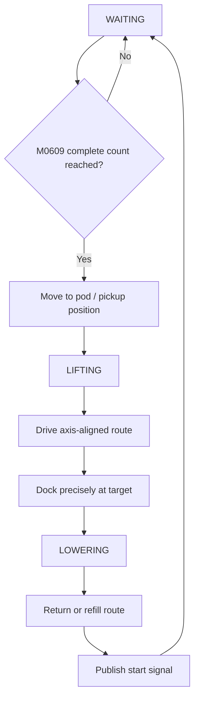

Motion control:

- Uses ROS2 `/cmd_vel` for differential drive.
- Uses `/lift_cmd` for lift joint position.
- Uses odometry converted into minimap/world frame.
- Uses axis-aligned movement for reliable warehouse navigation:
  - rotate to target heading,
  - drive along X or Y,
  - dock with PID for precise final placement.

## 7. Spot Algorithm

Relevant file:

- `main_isaac/robots/spot/spot_agent.py`

Role:

- Patrol between configured waypoints.
- Use wrist camera to detect ArUco markers.
- Select nearest box.
- Approach, lower, grasp, raise.
- Navigate to marker goal zone.
- Release box.

FSM:

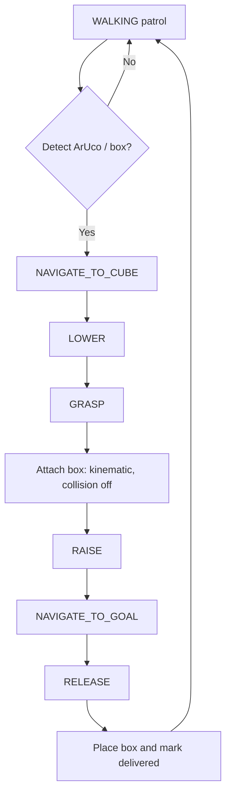

Spot locomotion:

- Uses `SpotFlatTerrainPolicy`.
- Navigation command is `[forward_velocity, lateral_velocity, yaw_rate]`.
- Heading error is controlled with proportional yaw correction.
- Forward speed is reduced when heading error is large.

## 8. Collision Avoidance

Collision avoidance is implemented at several layers.

### 8.1 Physics Collision Layer

Isaac Sim rigid-body/collision APIs handle contact between:

- Ground plane and robots.
- Ground plane and boxes.
- Delivery pod and falling boxes.
- Warehouse geometry and physical robots.

Some visual tools intentionally disable collision:

- Drone sucker: visual only, collision disabled.
- M0609 suction tool and RealSense: collision disabled.
- Spot gripper visual assembly: collision removed to avoid unstable physics.

Reason:

Small attached visual meshes can create unrealistic collision impulses and destabilize robots. The project models gripping logically through kinematic attachment instead.

### 8.2 Path Planner Layer

`path_planner.py` provides global A* planning:

- Grid resolution: `0.5 m`.
- Static obstacles: warehouse outer walls.
- Dynamic obstacles: current positions of other agents, inflated by a robot radius.
- Uses 8-neighbor A*.
- Smooths paths by line-of-sight when safe.

Flow:

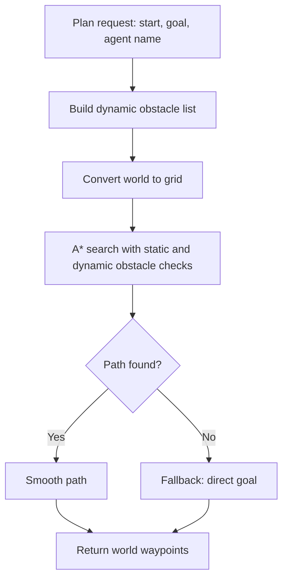

### 8.3 Spot Avoidance Layer

Spot robots have the most explicit local collision avoidance:

- Pod/section no-go zones push target points outside restricted areas.
- Conveyor no-go zones are avoided.
- Two Spot robots use priority-based yielding:
  - Lower-priority Spot yields when close to higher-priority Spot.
  - Detour points are generated using lateral offset plus forward offset.
  - This avoids deadlock where both robots stop.
- Spot also detours around IW Hub robots if close.

Spot local avoidance flow:

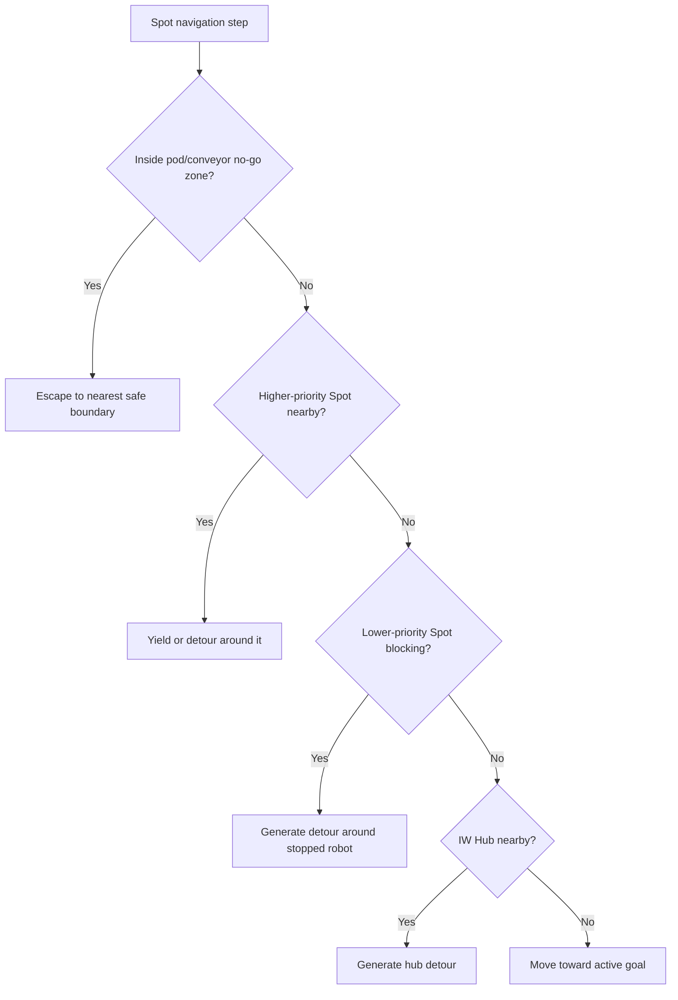

### 8.4 IW Hub and Spot Interaction

IW Hub 1 has a safety stop for Spot:

- It checks live Spot world positions.
- If a Spot is within `0.50 m`, the hub publishes zero velocity.
- When Spot clears the radius, the hub resumes its FSM command.

This is a simple proximity-based emergency stop:

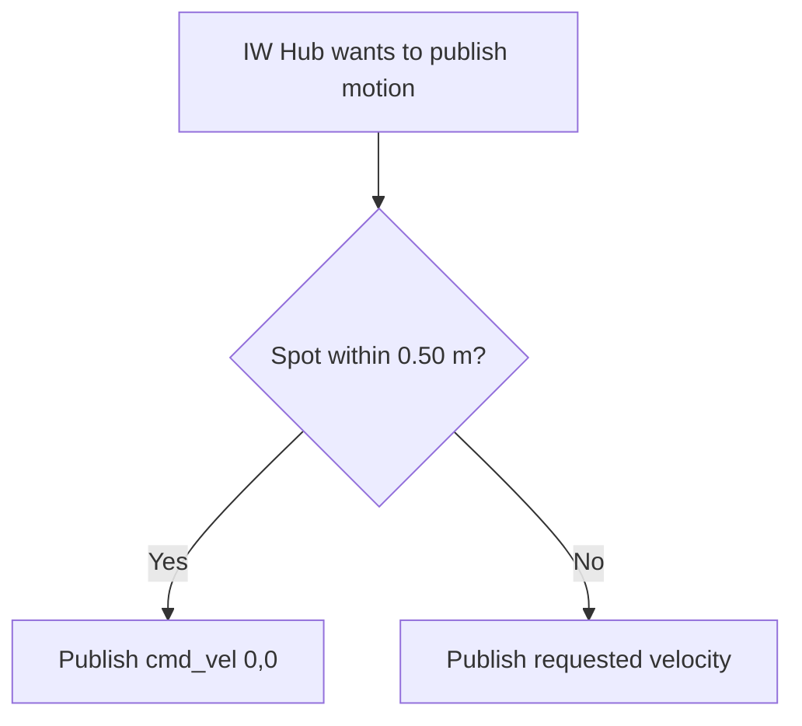

### 8.5 Drone Safety Layer

Drone collision avoidance is mainly boundary/altitude protection, not full obstacle perception:

- Safe XY clamping.
- Wall retreat if outside safe region.
- Altitude recovery if above `2.75 m`.
- Flight at `2.5 m` to clear most ground robots.
- Autopilot joystick lock to prevent human input fighting the mission.

Presentation note:

The drone does not currently perform full 3D obstacle detection. It uses altitude separation and safety guards. Ground robots use stronger local collision avoidance.

## 9. Inter-Robot Coordination

Coordination mechanisms:

- `work_signals.py`: in-process counter from M0609 to IW Hub.
- ROS2 topics:
  - M0609 publishes completion signals.
  - IW Hub publishes start signals.
  - IW Hub uses `/cmd_vel`, `/lift_cmd`, `/odom`, `/tf`.
- Minimap/control center provide visualization and manual interaction.

Coordination flow:

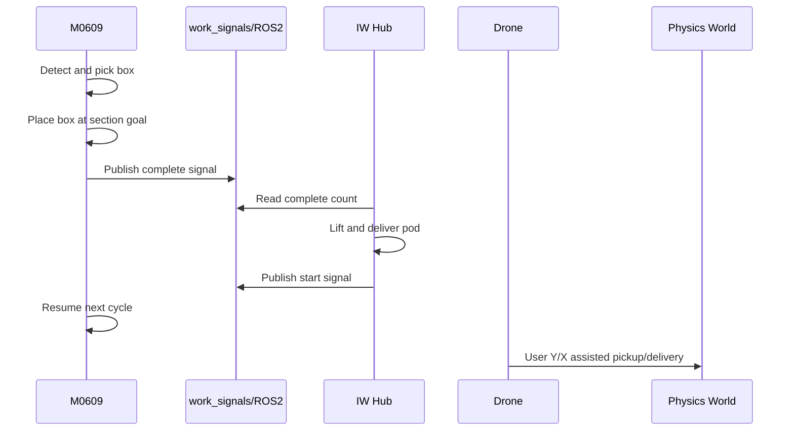

## 10. Key Physics Principles for Presentation

### Rigid Body Dynamics

Boxes and robots are represented using rigid bodies and collision geometry. Isaac Sim solves:

- Gravity.
- Contact forces.
- Collision response.
- Joint constraints.
- Articulation dynamics.

### Kinematic vs Dynamic Objects

Dynamic:

- Affected by gravity, contact, and collision.
- Used when boxes are free or released.

Kinematic:

- Not moved by gravity.
- Position is directly controlled by code.
- Used while robots are carrying a box.

This is the main abstraction for suction gripping.

### Gravity and Mass

All boxes are set to about `2.0 kg`.

Mass matters when a box is dynamic:

- Falling speed is governed by gravity.
- Contact force and collision response depend on mass and physics material.
- Heavier objects resist acceleration more, but free-fall acceleration is still approximately `9.81 m/s^2` without air resistance.

### Differential Drive

IW Hub motion uses differential drive:

- Linear velocity moves the robot forward/backward.
- Angular velocity rotates the robot.
- Left/right wheel speeds are computed through Isaac's differential controller.

### Quadrotor Flight

The drone flies by generating:

- Total thrust to counter gravity and move toward target.
- Body torque to rotate toward desired attitude.

It does not simply set position; it tracks a target through a dynamic controller.

### Robot Arm Motion

M0609 uses:

- RMPFlow for collision-aware/smooth inverse kinematics behavior.
- Linear interpolation for controlled vertical approach and placement.
- Visual servoing from ArUco pixel error during some pickup modes.

## 11. Suggested Presentation Slide Order

1. Problem Statement: multi-robot warehouse automation.
2. System Architecture: Isaac Sim world, agents, physics/render loops.
3. Warehouse Setup: pods, boxes, ArUco markers, 2 kg physical boxes.
4. Robot Roles: Drone, M0609, IW Hub, Spot.
5. Drone Manual and Autopilot Flow.
6. Drone Pickup/Delivery Flowcharts.
7. M0609 Vision-Based Pick-and-Place.
8. IW Hub Pod Transport FSM.
9. Spot Patrol and Box Handling.
10. Collision Avoidance Strategy.
11. Physics Modeling: rigid body, kinematic attachment, gravity release.
12. Coordination and Signals.
13. Demo Scenario: Y pickup, X delivery, M0609/IW Hub cycle, Spot avoidance.
14. Limitations and Future Work.

## 12. Limitations and Future Improvements

Current limitations:

- Drone does not use full 3D obstacle perception.
- Drone pickup uses logical suction attachment, not pressure simulation.
- Spot and IW Hub avoidance is mostly local/proximity based.
- A* planner currently models outer walls and dynamic robot positions, but not every pod/conveyor obstacle.
- Some routes are scripted for reliability instead of fully autonomous global planning.

Possible improvements:

- Add drone depth-camera obstacle avoidance.
- Add full 3D occupancy map for drone navigation.
- Expand A* static obstacle map to include all pod/conveyor zones.
- Use reservation-based traffic control for IW Hub and Spot intersections.
- Add settle detection after delivery release before marking final success.

